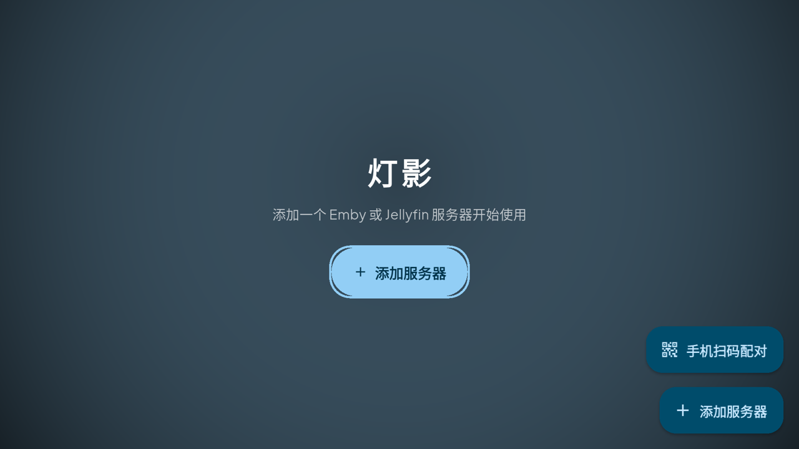
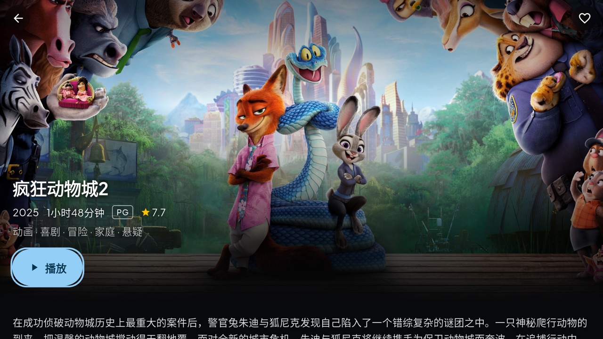
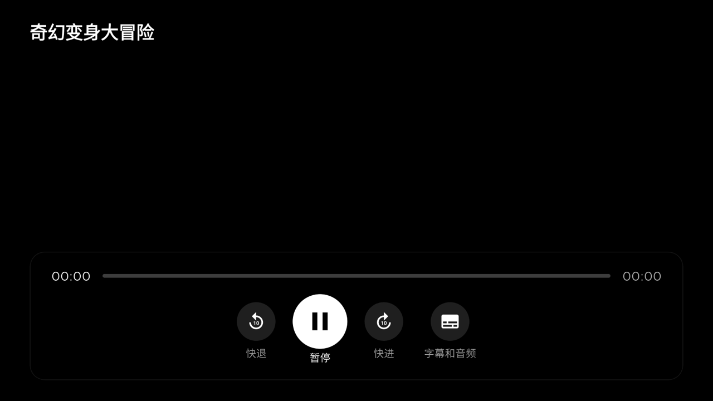

# 灯影 DengYing

**English** | [简体中文](README.zh-CN.md)

### Your Emby & Jellyfin library deserves an app this good.

DengYing (灯影) is a fast, good-looking media player for your own collection — everything plays, everything looks right, and on TV it feels like the app you already know how to use.

One app, everywhere that matters: **macOS · Windows · Linux · Android · Android TV · iOS**.

<p align="center">
  
  
  
</p>

---

## Why DengYing

**Every format, no fuss.** Built on the MPV engine, DengYing plays almost anything you throw at it — MKV, HEVC, EAC3, DTS, whatever your rip came in — with hardware decoding, straight from the file. No transcoding, no server strain, no re-encoding your library to make it "compatible."

**Feels like Netflix on TV.** On-screen playback controls, a real subtitles-and-audio panel, a remote that always knows where you are. Point it, press it, it works — see [TV remote](#tv-remote) below.

**Never lose your place.** Progress follows you across every device automatically. Pause on the TV, pick it back up on your phone. Episodes queue up and play on their own, right through the season finale.

**One password entry, ever.** Setting up a TV with a remote is miserable. Scan a QR code with your phone, fill in your server details there instead, and the TV logs itself in. No Quick Connect required — works with any Emby or Jellyfin server.

**Looks this good everywhere.** Same refined design on every platform — clean type, smooth motion, real depth — not the flat, default look most cross-platform apps settle for.

**Both servers, one app.** Emby and Jellyfin, side by side. Manage as many servers as you want and switch with one tap.

---

## TV remote

| Button | While watching |
|---|---|
| OK | Show controls / play / pause |
| Left · Right | Seek back / forward 10s |
| Up · Down | Show controls |
| Menu (or the dedicated subtitle key, if your remote has one) | Open subtitles, audio & speed |
| Back | Hide controls, then exit |

Controls fade away while you watch and reappear the moment you touch the remote — and stay put whenever you pause, so you're never guessing what's on screen. Subtitles, audio tracks, and playback speed live in one clean panel instead of a buried menu. Wherever you land — home screen, a show's page, your library — the remote works immediately, no hunting for a starting point.

## What's inside

| Area | Details |
|---|---|
| Home | Continue Watching (one-tap resume), latest additions per library |
| Browse | Grid with infinite scrolling, sort by name / date added / year / rating |
| Search | Full-library search as you type |
| Details | Resume or restart, season & episode browser, favorites |
| Player | Audio track / subtitle switching (embedded **and** external Emby subtitles), playback speed, double-tap seek, fullscreen |
| Servers | Multiple servers, persistent sessions, re-login, QR pairing |

## Get it

Grab the latest build for your platform from [**Releases**](../../releases):

| Platform | Download | Notes |
|---|---|---|
| Android / Android TV | `dengying-*-android.apk` | `adb install` or sideload; shows up as a TV app automatically |
| macOS | `dengying-*-macos.zip` | Unsigned — right-click → Open on first launch |
| Windows | `dengying-*-windows.zip` | Unzip and run `dengying.exe` |
| Linux | `dengying-*-linux.tar.gz` | Requires `libmpv`: `sudo apt install libmpv2 mpv` |

## Get started

1. Launch the app → **Add Server**.
2. Enter your Emby/Jellyfin address, username and password — or on TV, hit **Pair via phone QR** and fill it in from your phone instead.
3. Browse and play. Your progress follows you everywhere.

---

<details>
<summary><strong>For developers</strong> — build from source, project layout</summary>

```bash
git clone https://github.com/hanshengcc/dengying-player.git
cd dengying-player
flutter pub get

flutter run -d macos      # or windows / linux / android / ios / chrome
flutter build apk --release
```

Platform notes:

- **Linux**: `sudo apt install libmpv-dev mpv ninja-build libgtk-3-dev`
- **macOS/iOS**: full Xcode + CocoaPods required
- **Web** builds run but are UI-preview only (browsers can't decode MKV/HEVC, and cross-origin servers need CORS)

```
lib/
├── api/            # Emby/Jellyfin REST client + models
├── state/          # App state: servers, session, theme, TV mode (persisted)
├── pages/          # servers / home / library / detail / search / player / settings / pairing
├── widgets/        # poster card, section row, TV focus highlight
└── utils/          # TV detection, LAN pairing HTTP server, formatting
```

- **Playback**: `media_kit` wraps libmpv on every platform; a permissive device profile keeps the server from transcoding.
- **State**: lightweight `provider` + `shared_preferences`.
- **TV mode**: auto-detected via `UiModeManager` on Android, manual toggle everywhere else.

</details>

## License

[MIT](LICENSE)
